23Tree
====================
Building with AppVeyor: 

Building with Travis: 

This repository has a project with the implementation of a 23Tree.

It is written in C++.

The code of the 23Tree is independent of platform.

Is has two possible main files:

* [Codes](#markdown-header)
	* [A main that triggers unit test;](#markdown-header-emphasis)

	* [A Qt project to manage the 23Tree (With Gui).](#markdown-header-strikethrough)
	
The library used to make the Unit Test is the Catch v2.12.3. The code is already in this repository.

The Qt project generates images of the 23Tree, using the lib Graphviz.
Install this lib in your computer for you to be able to create such images.

The code was written containing the Doxygen documentation.

- - -

You have several options to build the project: 
====================

* [Build tools](#markdown-header)
	* [Makefile (using the file named MakefileGeneral);](#markdown-header-emphasis)
	* [CMake.](#markdown-header-emphasis)
	* [Qt Project (With QMake).](#markdown-header-emphasis)

The project has no leaks (Fully tested with Valgrind).

All the unit tests are ok.

- - -

The functionalities available are: 
====================

* [Functionalities](#markdown-header)
	* [Insert;](#markdown-header-emphasis)
	* [Search;](#markdown-header-emphasis)	
	* [Remove.](#markdown-header-emphasis)
	
- - -

Sample images: 
====================

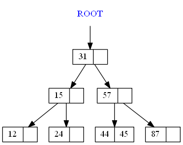

Qt gui project: 
====================
The qt gui application gui is shown below:

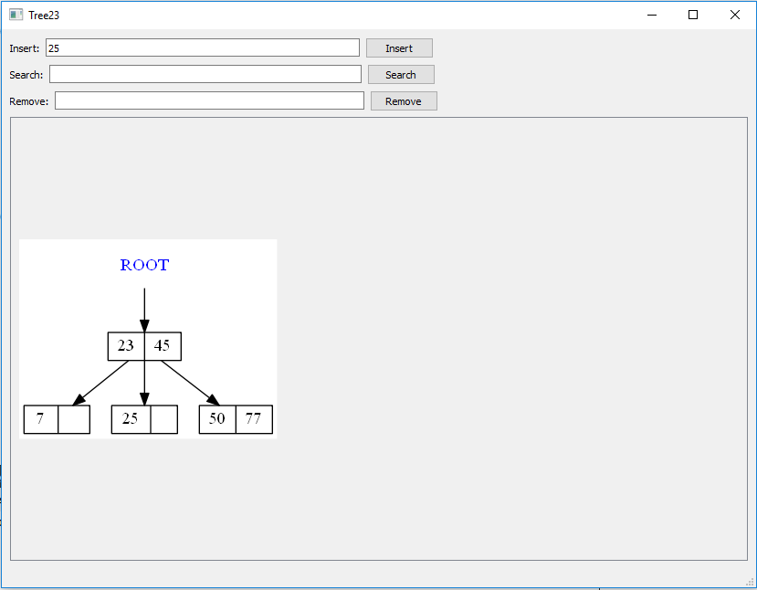

Insertion steps: 
====================

## Initial:

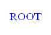

## Inserting 50:

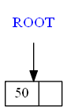

## Inserting 40:

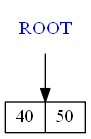

## Inserting 60:

## Inserting 70:

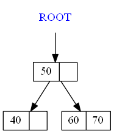

## Inserting 80:

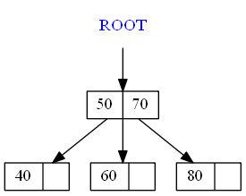

## Inserting 90:

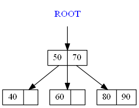

## Inserting 45:

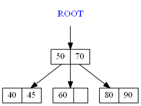

## Inserting 55:

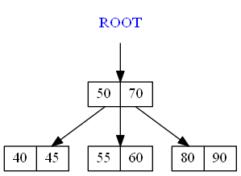

## Inserting 85:

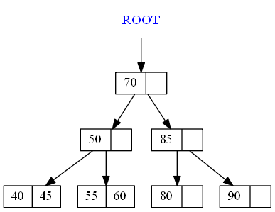

Removing samples: 
====================

## Initial:

## Removing 40:

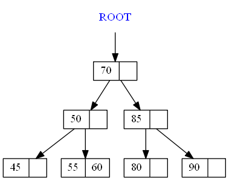

## Removing 55:

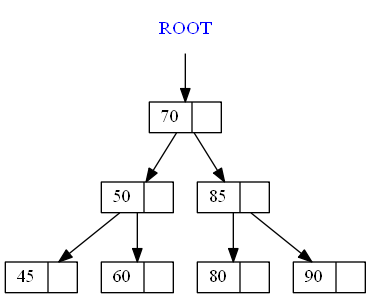

## Removing 60:

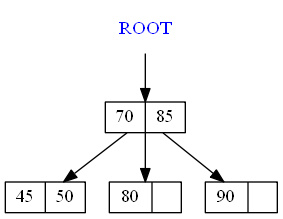

## Removing 80:

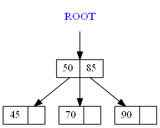

## Removing 45:

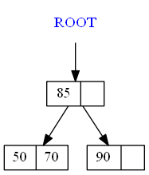

## Removing 70:

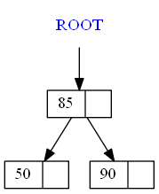

## Removing 90:

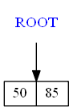

## Removing 50:

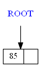

## Removing 85:

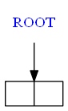
